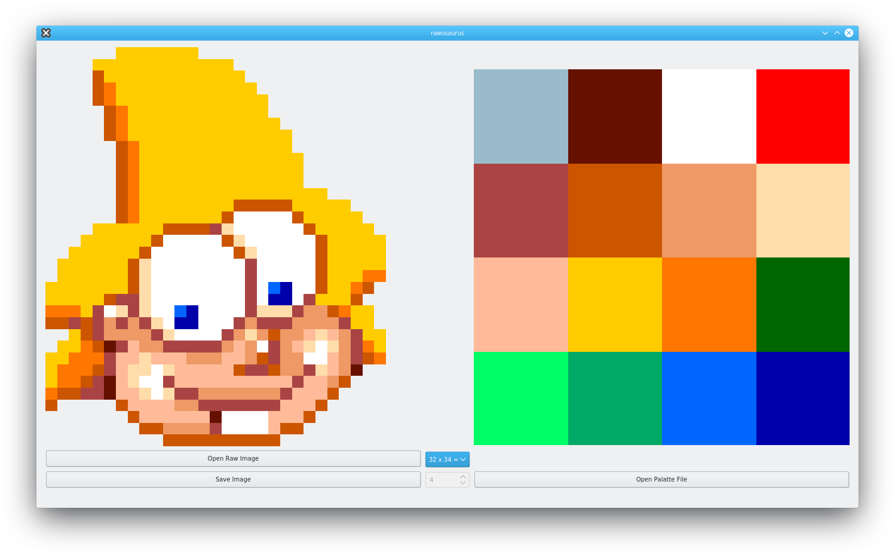

# rawosaurus

rawosaurus is a Amiga RAW images to PNG converter. As the name suggests, I originally wrote it for @vigo's [dinozorus](https://github.com/vigo/dinozorus) but it'll probably work for other Amiga games too.

There are a few small bugs that I'm going to fix in a very short time. Also I'm going to add the following two features:

* Custom plane support. I don't know if there are more or less than four planes in Amiga, but I'll add this featue just in case. Currently four planes are hardcoded.
* An image classifier that will automatically find the right image resolution. I guess something like this can be done with OpenCV or a similar library.

## Similar projects

- [Maptapper](http://codetapper.com/amiga/maptapper/)
- [AmigaFFH](https://github.com/cran/AmigaFFH)
- [amiga_assembly](https://github.com/lucasw/amiga_assembly)
- [amiga_examples](https://github.com/alpine9000/amiga_examples)
